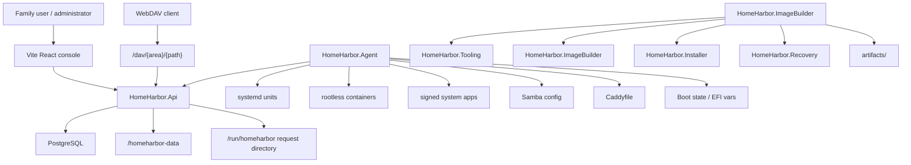
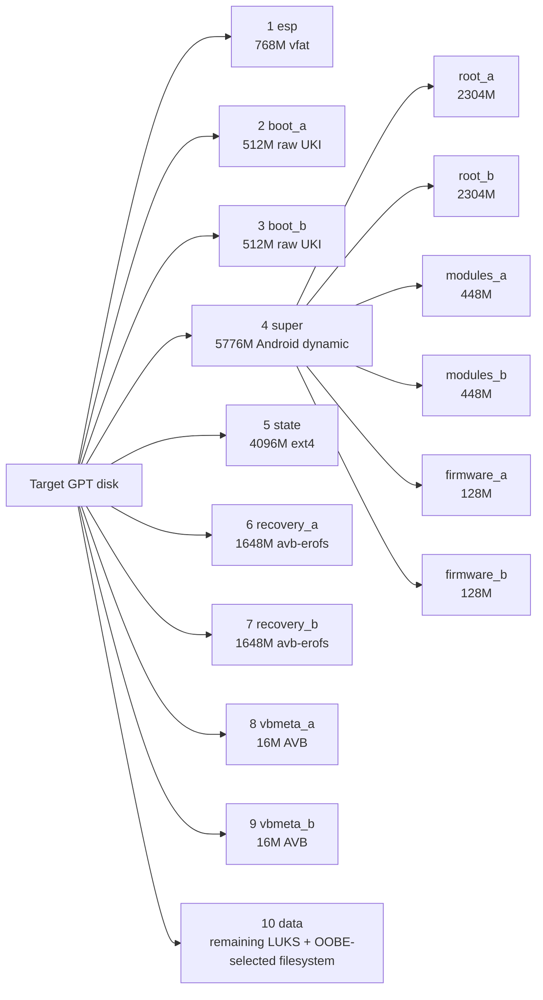

# Architecture

HomeHarbor has four main layers: the control plane, appliance runtime, image/installer/recovery toolchain, and release validation pipeline.

## Control Plane

`HomeHarbor.Api` is the central control plane. It provides:

- Initial setup and pairing.
- JWT login, session validation, and logout.
- Family members, devices, and WebDAV tokens.
- Files, photos, backups, vault, and remote access.
- SMB shares and credentials.
- Managed app/container desired state, including signed system app downloads.
- Reverse proxy routes and automation-rendered Caddyfile output.
- OTA status, stage, and apply metadata.
- Storage OOBE inventory, recommendation, plan, and apply.

The API uses EF Core with PostgreSQL. Entity definitions live in `src/HomeHarbor.Api/Data`; shared domain types live in `HomeHarbor.Core`.

## Authentication Model

The default authorization fallback policy requires a user JWT whose `AuthClaims.TokenKind` is `User`. User JWTs are bound to member sessions in the database; the token id hash must match the session and the session must not be expired.

Automation commands use a separate JWT whose token kind is `Automation`. It can only access endpoints marked with `AuthorizationPolicies.Automation`, such as Caddyfile rendering, SMB reconcile, container reconcile, and storage health checks.

WebDAV does not use bearer tokens. It uses the Basic Auth handler and WebDAV tokens for `/dav/{area}/{path}`.

## Appliance Runtime

`HomeHarbor.Agent` is the command collection called by systemd and appliance services. It handles:

- firstboot directory, permission, and channel initialization.
- PostgreSQL init/bootstrap.
- Caddyfile initialization and rendering from the API.
- Storage health.
- SMB config and Samba reload.
- Container desired state application.
- Signed system app payload download, verification, hot wrapper exposure, and reboot-time `/usr` overlay activation.
- Boot attempt, boot success, and OTA commit.
- Storage apply.
- boot-state, manifest verify, and super partition subcommands.

The commands write runtime state under `/var/lib/homeharbor`, `/run/homeharbor`, `/homeharbor-data`, and system service directories.

## Partition Layout

`HomeHarbor.ImageBuilder plan` reads `system/x86_64/system/manifest.yml`, prints the appliance disk layout, and the live installer writes the same GPT partition order to the target disk.

| Index | Label | Size | Format | Role |
| --- | --- | --- | --- | --- |
| 1 | `esp` | 768M | vfat | EFI selector and boot slot state. |
| 2 | `boot_a` | 512M | raw UKI | Normal boot payload for slot A. |
| 3 | `boot_b` | 512M | raw UKI | Normal boot payload for slot B. |
| 4 | `super` | 5776M | Android dynamic | Container for verified root, modules, and firmware logical partitions. |
| 5 | `state` | 4096M | ext4 | OTA boot metadata, `boot_a.env` / `boot_b.env`, and persistent markers. |
| 6 | `recovery_a` | 1648M | avb-erofs | Recovery rootfs, embedded recovery UKI, and appended AVB hashtree for slot A. |
| 7 | `recovery_b` | 1648M | avb-erofs | Recovery rootfs, embedded recovery UKI, and appended AVB hashtree for slot B. |
| 8 | `vbmeta_a` | 16M | avb-vbmeta | Slot-transparent AVB descriptors mirrored for slot A. |
| 9 | `vbmeta_b` | 16M | avb-vbmeta | Slot-transparent AVB descriptors mirrored for slot B. |
| 10 | `data` | Remaining disk | LUKS + OOBE-selected filesystem | Files, photos, backups, PostgreSQL data, and other family data. |

Inside `super`, HomeHarbor keeps verified EROFS payloads as logical partitions:

| Logical partition | Parent | Size | Role |
| --- | --- | --- | --- |
| `root_a` | `super` | 2304M | Immutable rootfs for slot A. |
| `root_b` | `super` | 2304M | Immutable rootfs for slot B and OTA target when A is active. |
| `modules_a` | `super` | 448M | Kernel modules for slot A. |
| `modules_b` | `super` | 448M | Kernel modules for slot B. |
| `firmware_a` | `super` | 128M | Pruned Linux firmware tree for slot A. |
| `firmware_b` | `super` | 128M | Pruned Linux firmware tree for slot B. |

The installer seeds both A and B logical slots from the installation payload. Normal boot uses `boot_a` or `boot_b`, reads the matching boot environment from `state`, maps the selected `super` logical partitions, and verifies them through the matching `vbmeta_*` partition. OTA writes the inactive boot, vbmeta, root, modules, and firmware targets before switching boot state.

## Release Flow

Channel release scripts live under `build/`. The typical flow is:

1. Build Arch packages.
2. Generate rootfs, modules, firmware, recovery, boot, and vbmeta payloads.
3. Generate OTA bundles and manifests.
4. Sign manifests.
5. Generate full and tiny live installer ISOs.
6. Run channel readiness checks.
7. Publish channel metadata and release artifacts.

The shell scripts remain entrypoints, but reusable business rules should move into C# tooling.
