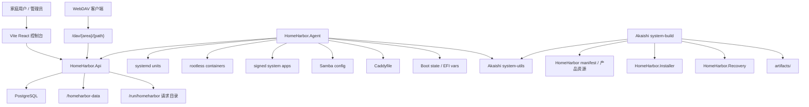
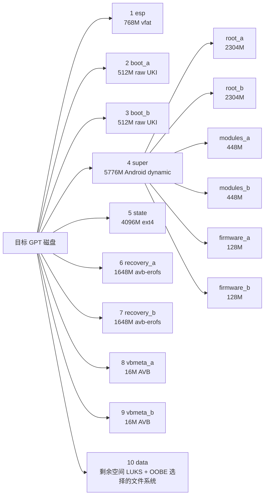

# 整体架构

HomeHarbor 可以看成四层：控制平面、appliance 运行时、镜像/安装/恢复工具链、发布与验证链路。

## 控制平面

`HomeHarbor.Api` 是中心控制面。它提供：

- 初始 setup 和 pairing。
- JWT 登录、session 校验和 logout。
- 家庭成员、设备、WebDAV token。
- 文件、照片、备份、vault、remote access。
- SMB share 与 credential。
- managed app/container desired state，包括签名 system app 下载。
- 反向代理 route 与 Caddyfile 自动化输出。
- OTA status、stage、apply metadata。
- 存储 OOBE inventory、recommendation、plan、apply。

API 使用 EF Core + PostgreSQL，领域数据表位于 `src/HomeHarbor.Api/Data`。共享类型在 `HomeHarbor.Core`。

## 认证模型

默认 authorization fallback policy 要求用户 JWT，并要求 `AuthClaims.TokenKind` 为 `User`。用户 JWT 会绑定数据库中的 member session；token id 的 hash 必须与 session 匹配且未过期。

自动化命令使用独立 JWT，claim kind 为 `Automation`，只允许访问带 `AuthorizationPolicies.Automation` 的端点，例如 Caddyfile、SMB reconcile、container reconcile、storage health check。

WebDAV 不使用 bearer token，而是通过 Basic Auth handler 和 WebDAV token 访问 `/dav/{area}/{path}`。

## Appliance 运行时

`HomeHarbor.Agent` 是 systemd 和 appliance 服务调用的命令集合。它负责：

- firstboot 目录、权限和 channel 初始化。
- PostgreSQL init/bootstrap。
- Caddyfile 初始化和从 API 渲染。
- storage health。
- SMB config 与 Samba reload。
- container desired state 应用。
- 签名 system app payload 下载、校验、热生效 wrapper 暴露，以及重启时 `/usr` overlay 激活。
- boot attempt、boot success、OTA commit。
- storage apply。
- boot-state、manifest verify、super partition 子命令。

这些命令将运行时状态写入 `/var/lib/homeharbor`、`/run/homeharbor`、`/homeharbor-data` 和系统服务目录。

## 分区布局

固定版本的 `system-build` CLI 会读取 `system/x86_64/system/manifest.yml` 并输出 appliance 磁盘布局，live installer 会按同样的 GPT 分区顺序写入目标磁盘；可复用的 A/B 与 OTA primitive 来自它固定的 `system-utils` revision。

| 序号 | Label | 大小 | 格式 | 作用 |
| --- | --- | --- | --- | --- |
| 1 | `esp` | 768M | vfat | EFI selector 与 boot slot state。 |
| 2 | `boot_a` | 512M | raw UKI | slot A 的 normal boot payload。 |
| 3 | `boot_b` | 512M | raw UKI | slot B 的 normal boot payload。 |
| 4 | `super` | 5776M | Android dynamic | verified root、modules、firmware 逻辑分区容器。 |
| 5 | `state` | 4096M | ext4 | OTA boot metadata、`boot_a.env` / `boot_b.env` 与持久 marker。 |
| 6 | `recovery_a` | 1648M | avb-erofs | slot A 的 recovery rootfs、内嵌 recovery UKI 与 AVB hashtree。 |
| 7 | `recovery_b` | 1648M | avb-erofs | slot B 的 recovery rootfs、内嵌 recovery UKI 与 AVB hashtree。 |
| 8 | `vbmeta_a` | 16M | avb-vbmeta | slot A 镜像保存的 slot-transparent AVB descriptors。 |
| 9 | `vbmeta_b` | 16M | avb-vbmeta | slot B 镜像保存的 slot-transparent AVB descriptors。 |
| 10 | `data` | 剩余磁盘 | LUKS + OOBE 选择的文件系统 | 文件、照片、备份、PostgreSQL 数据与其他家庭数据。 |

`super` 内部使用 verified EROFS payload 作为逻辑分区：

| 逻辑分区 | 父分区 | 大小 | 作用 |
| --- | --- | --- | --- |
| `root_a` | `super` | 2304M | slot A 的 immutable rootfs。 |
| `root_b` | `super` | 2304M | slot B 的 immutable rootfs；A active 时也是 OTA target。 |
| `modules_a` | `super` | 448M | slot A 的 kernel modules。 |
| `modules_b` | `super` | 448M | slot B 的 kernel modules。 |
| `firmware_a` | `super` | 128M | slot A 的裁剪版 Linux firmware tree。 |
| `firmware_b` | `super` | 128M | slot B 的裁剪版 Linux firmware tree。 |

安装时 installer 会用安装 payload 初始化 A/B 两组逻辑 slot。Normal boot 使用 `boot_a` 或 `boot_b`，从 `state` 读取对应 boot environment，映射选中的 `super` 逻辑分区，并通过对应的 `vbmeta_*` 分区校验。OTA 会先写入 inactive boot、vbmeta、root、modules、firmware target，再切换 boot state。

## 发布链路

channel 发布脚本位于 `build/`。核心链路通常是：

1. 构建 Arch package。
2. 生成 rootfs、modules、firmware、recovery、boot、vbmeta 等 payload。
3. 生成 OTA bundle 和 manifest。
4. 签名 manifest。
5. 生成 full/tiny live installer ISO。
6. 运行 channel readiness 检查。
7. 发布 channel metadata 和 release artifact。

发布脚本仍保留为 shell 入口，但可复用业务逻辑应迁入 C# 工具。
